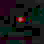

# Astrophotography Image Stacking Demo

This is a project work report on the Introduction of Mathematics of Photography 2023 course (University of Helsinki), and it demonstrates a simple method of aligning and stacking multiple wide field night sky images taken on a DSLR to overcome the SNR (signal-to-noise) limitations of the camera sensor.

### Running

Running requires Matlab with the image processing toolkit installed. An example dataset of 10 jpeg images are included in the repo for testing, located in the `lights` folder. Lossless image formats should be used in practise. The script is implemented in `astro_stacking.m`, which reads all images from `lights` and writes the result to the project root.

## Introduction

The task of imaging the night sky has many interesting challenges. The first and foremost is that objects are very dim: on good conditions, the naked eye can see a few thousand stars and a few of the brightest galaxies and nebulae (when one knows precisely where to look). For a camera sensor under ideal conditions, the amount and detail of the night sky objects it can image is governed by two values: its light gathering capabilities versus the sensor noise. Light gathering performance can be improved for example by using a more sensitive sensor or a larger aperture lens, and sensor noise can be reduced by higher quality electronics or by cooling the camera components down (Morison 2017). In this study we consider the common amateur astrophotographer situation where we only have access to a mainstream DSLR, and attempt to improve our imaging performance through the process of stacking multiple images in software. We are using the DSLR Canon EOS 550D.

The goal is simple: try to take a wide field photo of the night sky that has as much objects visible as possible. The main issue preventing us from imaging all but the brightest stars is our camera's signal to noise -ratio (SNR). Assuming our camera is producing gaussian pixel noise with sigma N, any object that results in pixel magnitude of S where S is close to the magnitude of N will be hard to distinguish from noise. S is governed by how many photons from that object hit the sensor. By increasing the exposure time, we increase the chances that more photons hit the sensor, and hopefully increase S until it is statistically significant compared to N. In fact, according to XYZ law, our SNR should increase in the square root of the exposure time. 

The issue preventing us from simply tuning the camera's exposure time setting to the maximum is the earth's rotation. At above 20 seconds, star trails start to become clearly visible. The photons from the same objects no longer hit the same parts of the sensor, and we start to lose detail and cannot further improve the SNR. The hardware solutions would be to mount the camera on a motorized equatorial mount or to put it in space, but we have access to neither. Here comes the idea of image stacking: instead of one long exposure, we can take multiple photos with a shorter exposure and average them to gain the same SNR improvement as with one long exposure. To do this, the images must be aligned to each other to counter the earth's rotation, which we can do in software.

## Data collection

Our main dataset consists of 50 5184 × 3456 raw images. The DSLR was set on a tripod and the images were taken at 20 seconds of exposure time, focal length of 18 mm and f/9. In total, we have 1000 seconds or approximately 17 minutes of exposure.
The ISO setting is kept at a constant 1600. All the images are taken within 2-10 seconds of the previous. A light pollution filter is used although its effect is not measured. No preprocessing is done outside of the Matlab script. An example dataset of 10 jpeg images from the main dataset is included for test running the script, but for actual usage raw fileformats should always be used.

## Image processing method

The whole astrophotography image stacking process is implemented in the Matlab script `astro_stacking.m`. In summary, the process consists of the following steps:

1. Read in all the images and convert them to double precision. Scale the pixel values to 0-1.
2. Noise reduction: remove the speckle-like noise produced by hot pixels of the camera sensor.
3. Find locations of a group of stars that are present in each image.
4. Infer the transformations between the stars in the images compared to one reference image.
5. Align the images to the reference by applying the transformations and stack them.
6. Do some simple post-processing and write the result to a file.

The script consists of multiple sections which roughly correspond to these steps. Each step's implementation is explained in more detail in code comments.

### Noise reduction

A major issue that comes with digital astrophotography is the sensor noise, which comes in roughly two forms: hot pixels and dark current. Dark current is noise caused largery by the electronic equipment in the camera interfering with the sensor (Dark current, Wikipedia). We focus on dealing with hot pixels, which are caused by faulty sensor pixels which register signal under long exposures when they shouldn't (Covington 2007). To an untrained eye hot pixel noise resembles stars and is problematic to any image alignment technique that relies on pixel luminance information. 

<figure>
    
    
    <figcaption>
        Example of a hot pixel (right) compared to Cassiopeia A in our main dataset.
    </figcaption>
</figure>

A common technique to counteract this is to use a so called 'dark frame', an image that is captured with the same settings as the 'light frames' but with the lens cap on, and then subtract it from the light frames (Covington 2007).

A different method we came up to remove a significant amount of this noise exploits the fact that if multiple light frames are taken, the bad pixels should remain constant but the sky objects should move. By multiplying the `n` images elementwise and taking the `n`:th root of the result, we're left with an image where the bad pixels are orders of magnitude brighter than the rest of the image. 

<figure>
    
    
    <figcaption>
        The same hot pixel (right) in the multiplied image next to Cassiopeia A, proving that the bad pixel is fairly constant in all images while the star is not.
    </figcaption>
</figure>

We can then run a 5x5 disk shaped max-filter (`imdilate` in Matlab) to fill an area around the bad pixel with its brightest value. We then binarize the resulting image to create a bad pixel mask. This is done for the luminance, red and blue channels with tuneable thresholds. 

<figure>
    
    <figcaption>
        Mask at the bad pixel
    </figcaption>
</figure>

Finally the mask is applied to each image to remove the detected bad pixels.

<figure>
    
    
    <figcaption>
        The bad pixel (right), which is fairly well removed after masking, and Cassiopeia A which is unaffected.
    </figcaption>
</figure>

### Finding reference stars

Our goal is to find a number of stars' locations that are present in each image, so that we can use their location information to align the images to each other. Many good algorithms exist for this (Beroiz et al 2020), but in our case we use a rather primitive method that makes a lot of assumptions about our input data. We assume that our images are taken in a short time (not much longer than the exposure time) of each other, and are loaded in chronological order. 

First we find some bright stars in each image by going through each pixel, and when finding a bright pixel, we register it as a star and store its XY-location. Because stars in our images consist of multiple pixels, we also check that there are no other already registered stars near the bright pixel. This way we generate a list of candidates for reference stars in each image.

Next we prune the candidates so that only stars that are visible in every image are left. This is done by looking at each star's location in each image and checking that a star exists close to the same location in every other image when considering the chronological distance between the images. This method is potentially error-prone, but with some parameter tweaking works well enough on the datasets we've tested.

<figure>
    
    <figcaption>
        Reference stars found in our dataset. The middle constellation is Cassiopeia.
    </figcaption>
</figure>

### Inferring transformations and stacking

We select the chronologically middle image to be the fixed reference. Using the Matlab function `fitgeotform2d`, we infer a 2D transformation consisting of translation, rotation and scaling that best aligns the reference stars between each image and the reference image. Now the transformation can be applied to each image using `imwarp` 

## Results and analysis

The main dataset of 50 images and 17 minutes of exposure with our method produces an image with significantly more detail than any single image, and slightly seems to surpass what a bare eye would be able to see. We can see for example the Double Cluster and M13. The result is still quite far from impressive considering how much exposure time we had.

<figure>
    
    
    <figcaption>
        Double cluster (left) and M13 are cleary visible in the result, albeit far from impressive.
    </figcaption>
</figure>

It is clear that our alignment method is only partially successfull. For the main dataset, it manages to align the central region of the images fairly well but regions further from the center leave clear star trails. 

A few different alignment methods were tried during this study. First, the gradient descent -based Matlab `imregister` with mse cost function was tested, but it performed very poorly. We speculated that this was due to the optimized not finding any gradient between the very sparse images of stars, so the alignment was attempted with heavily blurred images. This yielded partial success but still often resulted in very large errors. Next, the `imregcorr`, which uses phase correlation to find a good transform, was tested and it managed to perform well with the blurred alignment images on some datasets but very poorly on most.

Image alignment based on star location information is clearly the de facto method in astrophotography, and the methods such as that presented in Beroiz et al 2020 are very robust. In our method, we identify the main issues causing poor aligmnent to be the reference star registration algorithm possibly in tandem with the geometric transformation inferring using `fitgeotform2d`. The accuracy of the star registration can be poor due to the method simply scanning pixels linearly and finding the first bright pixel of a star instead of trying to find the actual star center. In addition, the method finds more reference stars near the center, as the stars near the edges are often not present in each image due to rotation, missing out on some potentially useful alignment information. `fitgeotform2d` also is not ideal for our setup, as it includes scaling in the transformation, which is not useful in our datasets as the magnification is constant.

The hot pixel noise reduction method used in the study is quite successfull in removing the hot pixels from the image. It's main problem is that its parameters must be tuned for each dataset individually. If the noise threshold is set too high, a lot of hot pixels may be visible as "noise-trails" in the resulting image. If the noise threshold is too low, the noise reduction may produce a lot of "holes" in the resulting image and eat into the signal.

<figure>
    
    <figcaption>
        Strong blue noise trails appear when the noise reduction threshold is too high and does not detect hot pixels.
    </figcaption>
</figure>

Compared to the typical dark-frame noise removal, our method is faster in the data collection phase as no calibration frames are taken, but it might performs poorer in the end result.
In this study we do not try to address any of the gaussian-like noise caused by factors such as dark current. The choice of ISO 1600 may have contributed to the high noise levels in our images, which result in clearly visible trails left by noise after alignment.

<figure>
    
    <figcaption>
        Noise trails very visible in an amplified image after stacking.
    </figcaption>
</figure>

## Conclusion

In this study we developed an image stacking astrophotography software that can be used to overcome some of the SNR limitations of a DSLR on a fixed tripod. The methods we developed provided partial success but results showed that more work is needed to fix some of bigger issues in the current version. The poor performance of the star aligment is the primary problem that will be improved in future versions. The option to use dark frames will also be incorporated to improve the noise reduction method.

### Reflection

Doing this study was a very fun and educative experience. However, if I were to do something similar again I should focus more on research early on, instead of diving straight into practise. I did not have any real experience with DSLRs let alone astrophotography, so I made a lot of mistakes and the images used in the study were not as good as they could have been. I also made a lot of assumptions about the theoretical parts which I had to correct later when I spent time on research. 

## References

TODO

@article{BEROIZ2020100384,
    title = {Astroalign: A Python module for astronomical image registration},
    journal = {Astronomy and Computing},
    volume = {32},
    pages = {100384},
    year = {2020},
    issn = {2213-1337},
    doi = {https://doi.org/10.1016/j.ascom.2020.100384},
    url = {https://www.sciencedirect.com/science/article/pii/S221313372030038X},
    author = {M. Beroiz and J.B. Cabral and B. Sanchez},
    keywords = {Astronomy, Image registration, Python package},
    abstract = {We present an algorithm implemented in the Astroalign Python module for image registration in astronomy. Our module does not rely on WCS information and instead matches three-point asterisms (triangles) on the images to find the most accurate linear transformation between them. It is especially useful in the context of aligning images prior to stacking or performing difference image analysis. Astroalign can match images of different point-spread functions, seeing, and atmospheric conditions.}
}

Astrophotography, Wikipedia (viewed 24.10.2023)
https://en.wikipedia.org/wiki/Astrophotography

Signal Averaging,   (viewed 24.10.2023)
https://en.wikipedia.org/wiki/Signal_averaging

Dark Current,   (viewed 25.10.2023)
https://en.wikipedia.org/wiki/Dark_current_(physics)

@book{alma9934311169206253,
author = {Morison, Ian},
abstract = {In The Art of Astrophotography, astronomer and Astronomy Now columnist Ian Morison provides the essential foundations of how to produce beautiful astronomical images. Every type of astroimaging is covered, from images of the Moon and planets, to the constellations, star clusters and nebulae within our Milky Way Galaxy and the faint light of distant galaxies. He achieves this through a series of worked examples and short project walk-throughs, detailing the equipment needed - starting with just a DSLR (digital single lens reflex) camera and tripod, and increasing in complexity as the book progresses - followed by the way to best capture the images and then how, step by step, these may be processed and enhanced to provide results that can rival those seen in astronomical magazines and books. Whether you are just getting into astrophotography or are already deeply involved, Morison's advice will help you capture and create enticing astronomical images.},
address = {Cambridge},
booktitle = {The art of astrophotography},
isbn = {1-316-98170-3},
keywords = {Astronomical photography},
language = {eng},
publisher = {Cambridge University Press},
title = {The art of astrophotography / Ian Morison, Jodrell Bank, University of Manchester. [electronic resource]},
year = {2017},
}
